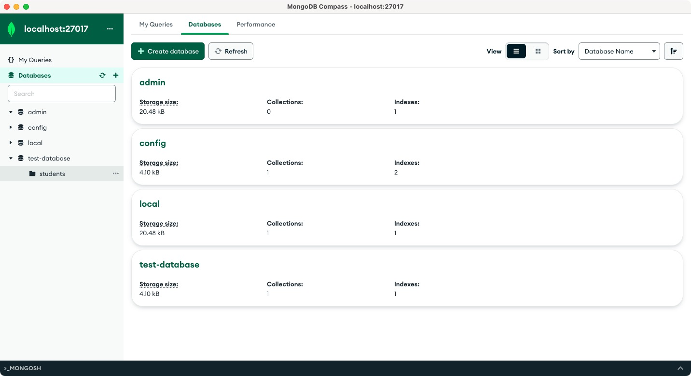

# 初识MongoDB


> MongoDB is a document database designed for ease of application development and scaling.

MongoDB是一种开源的文档型数据库管理系统。它采用了NoSQL（非关系型）的数据存储模式，可以处理大量的非结构化数据。MongoDB的设计目标是提供高性能、可扩展性和灵活性，以满足现代应用程序对数据存储的需求。

目前，MongoDB是一款应用非常普遍的数据库。

## MongoDB具有以下几个主要的优势和特点：
1. **灵活的数据模型**：MongoDB是一种文档型数据库，使用BSON格式存储数据，可以轻松地表示和处理复杂的数据结构。它支持嵌套文档和数组等数据类型，使数据模型更加灵活，适应变化和不确定性的数据需求。
2. **高性能**：MongoDB具有出色的读写性能，特别适合处理大量的非结构化数据。它支持水平扩展和自动负载均衡，可以处理高并发和大规模数据。此外，MongoDB还提供了索引和聚合框架等功能，优化查询性能和聚合操作。
3. **可扩展性**：MongoDB支持水平扩展，可以通过数据分片来扩展存储容量和吞吐量。它可以在集群中添加更多的节点，实现数据的分布式存储和处理，以满足不断增长的数据需求。
4. **自动故障恢复**：MongoDB具有自动故障恢复机制，能够在节点故障或网络中断等情况下保持数据的可用性。它支持数据复制和故障转移，确保数据的持久性和高可用性。
5. **查询能力**：MongoDB提供了强大而灵活的查询语言，可以进行复杂的查询和聚合操作。它支持各种查询条件、排序、分组和投影等操作，同时还提供了地理空间查询和全文搜索等功能。

## MongoDB适用于多种场景，特别是在以下情况下可以考虑使用：
1. **大数据和实时分析**：由于MongoDB具有高性能和可扩展性，它非常适合存储和分析大规模的数据集。它可以支持实时数据处理、数据挖掘和实时分析等场景。
2. **内容管理系统**：对于需要存储和管理各种类型的内容数据的应用程序，如博客平台、新闻网站等，MongoDB的灵活的数据模型和查询能力可以提供便利。
3. **用户数据管理**：对于需要存储和管理用户信息的应用程序，如社交媒体平台、电子商务网站等，MongoDB可以轻松处理不同用户属性和关系数据。
4. **实时数据存储和处理**：如果应用程序需要处理实时产生的数据，如日志、传感器数据等，MongoDB的高性能和可扩展性能够满足实时数据存储和处理的需求。

总而言之，MongoDB适用于许多不同类型的应用程序，特别是那些需要处理非结构化数据、具有大规模和高性能要求的场景。它提供了灵活的数据模型、强大的查询能力和可扩展性，使开发人员能够更好地处理和管理数据。

## 搭建MongoDB

我们可以使用Docker来轻松实现MongoDB的搭建和使用：
### 拉取Mongo容器并运行镜像

下面的命令这将创建一个名为"test-mongodb"的MongoDB容器，并将容器的27017端口映射到主机的27017端口。你可以根据需要修改容器和主机端口的映射：
```bash
docker pull mongo
docker run --name test-mongodb -p 27017:27017 -d mongo
```

### 连接到MongoDB容器

这将连接到运行的MongoDB容器，并进入MongoDB的命令行界面:
```bash
docker exec -it test-mongodb mongo
```

### MongoDB GUI
如果你觉得上面的命令行方式使用起来不方便，MongoDB官网推荐了[Compass](https://www.mongodb.com/try/download/compass)这个GUI工具,下载完成之后，可以使用！



## 用户管理

MongoDB提供了一系列对用户进行管理和授权的操作。下面是一些常用的MongoDB用户操作命令：

### 用户操作
1. **创建用户**：
这个命令用于创建一个新用户并为其分配角色和权限。

```bash
db.createUser({
  user: "<username>",
  pwd: "<password>",
  roles: [
    { role: "<role>", db: "<database>" },
    ...
  ]
})

db.createUser({
  user: "eason",
  pwd: "admin123",
  roles: [
    { role: "dbAdmin", db: "school" }
  ]
})
```

2. **修改用户密码**：
这个命令用于修改指定用户的密码。
```bash
db.changeUserPassword("<username>", "<new_password>")
```

3. **删除用户**：
这个命令用于删除指定的用户。
```bash
db.dropUser("<username>")
```

4. **列出数据库中的所有用户：**
这个命令用于列出指定数据库中的所有用户。
```bash
db.getUsers()
```

### MongoDB内置角色
MongoDB内置了一些常见的角色，这些角色具有不同的权限级别和功能。以下是一些MongoDB的内置角色：
1. **read**：允许用户读取指定数据库的数据。
2. **readWrite**：允许用户读取和写入指定数据库的数据。
3. **dbAdmin**：允许用户管理指定数据库的操作，如创建和删除集合、查看统计信息等。
4. **dbOwner**：允许用户执行指定数据库的所有操作，相当于拥有dbAdmin和readWrite权限。
5. **userAdmin**：允许用户管理指定数据库中的用户和角色。
6. **clusterAdmin**：允许用户在整个集群范围内执行管理操作，如添加和删除分片、创建和管理索引等。
7. **backup**：允许用户执行备份和恢复操作。
8. **restore**：允许用户执行恢复操作。

以上仅是一些常见的内置角色，MongoDB还提供了其他更细粒度的内置角色和自定义角色的配置选项，以满足不同的安全和权限需求。你可以参考MongoDB官方文档以获取完整的内置角色列表和详细说明。

例如：
```bash
> db.createUser({
...   user: "eason",
...   pwd: "admin123",
...   roles: [
...     { role: "dbAdmin", db: "school" }
...   ]
... })
Successfully added user: {
	"user" : "eason",
	"roles" : [
		{
			"role" : "dbAdmin",
			"db" : "school"
		}
	]
}
```

## MongoDB常用术语和基本概念

MongoDB有一些常用的术语和基本概念，下面是其中一些重要的：
1. **文档（Document）**：MongoDB的数据存储单位，类似于关系数据库中的行。文档是由一组键值对组成的，可以嵌套和包含不同类型的数据。
2. **集合（Collection）**：一组相关文档的容器，类似于关系数据库中的表。集合是动态的，可以在不事先定义模式的情况下存储不同结构的文档。
3. **数据库（Database）**：逻辑的文档集合，用于组织和存储数据。一个MongoDB服务器可以包含多个数据库。
4. **字段（Field）**：文档中的键或属性，用于表示不同的数据项。字段是由键值对组成的。
5. **主键（Primary Key）**：用于唯一标识文档的字段。在MongoDB中，默认为"_id"字段，可以自动生成唯一的标识符。
6. **索引（Index）**：用于提高查询性能的数据结构。MongoDB支持各种类型的索引，包括单字段索引、复合索引和地理空间索引等。
7. **查询（Query）**：用于从集合中检索文档的操作。可以使用查询条件、投影和排序等选项来过滤和限制返回结果。
8. **更新（Update）**：用于修改现有文档的操作。可以使用更新操作符来更新文档的字段值。
9. **聚合（Aggregation）**：用于对集合进行复杂数据处理和分析的操作。聚合操作可以对文档进行分组、筛选、排序和计算等操作，生成统计结果。
10. **分片（Sharding）**：一种水平扩展技术，用于将数据分布在多个物理服务器上，以提高存储容量和吞吐量。每个分片存储集合的一个子集。
11. **副本集（Replica Set）**：用于提供高可用性和故障恢复的MongoDB部署配置。副本集由多个MongoDB实例组成，其中一个是主节点，其他是从节点。

这些术语和概念是MongoDB中常用的，理解它们对于使用和管理MongoDB数据库非常重要。

## MongoDB对于Database的基本操作

MongoDB提供了一系列基本的数据库操作命令，以下是一些常用的命令示例：
1. 创建数据库：命令为`use [database]`, 这个命令用于切换到指定的数据库，如果该数据库不存在，则会创建一个新的数据库。
2. 查看当前数据库: 命令为`db`,这个命令用于查看当前所在的数据库。
3. 显示所有数据库: 命令为`show databases`, 这个命令用于列出所有的数据库。
4. 删除数据库: 命令为`db.dropDatabase()`, 这个命令用于删除当前所在的数据库。

例如：
```bash
> use testDatabase
switched to db testDatabase
> db.createCollection("students")
{ "ok" : 1 }
> show databases
admin         0.000GB
config        0.000GB
local         0.000GB
testDatabase  0.000GB
> db
testDatabase
> db.dropDatabase()
{ "dropped" : "testDatabase", "ok" : 1 }
> show databases
admin   0.000GB
config  0.000GB
local   0.000GB
```