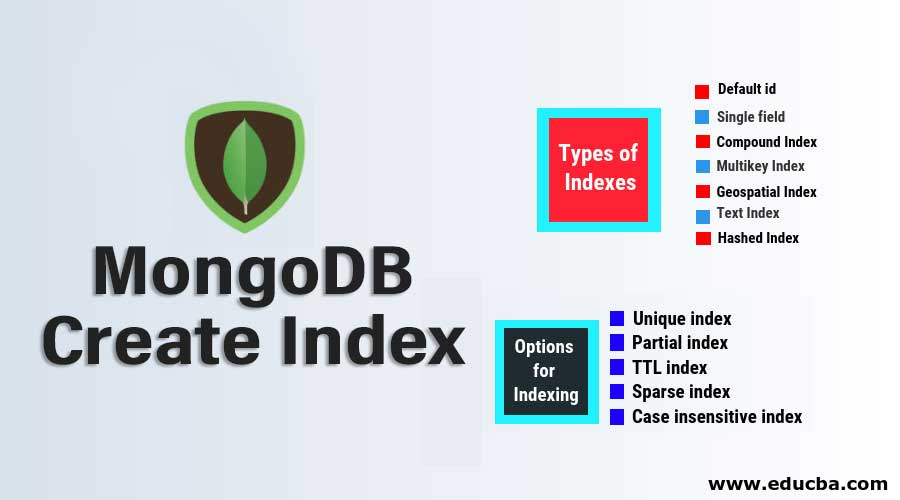
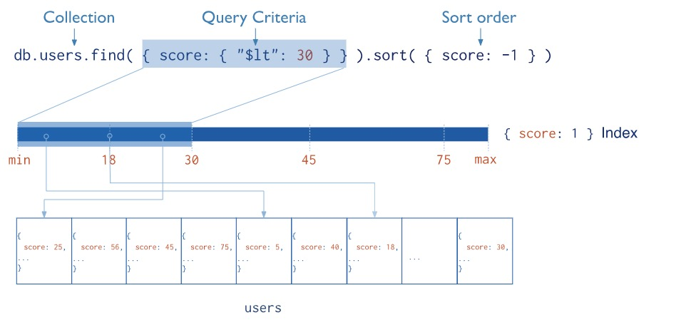

# MongoDB 的索引



索引是对任何数据库来说都非常重要，MongoDB亦是如此，它支持多种索引类型，今天我们就来学习它！

索引的真正的本质是降低我们查询数据所查询的范围，Mongodb 的索引是定义在 collection 级别的，使用B-tree 这一特殊的数据结构，支持对任何单个 field 以及任何 sub-field 建立索引。



## 默认的`_id`索引

Mongodb 在 collection 创建时会默认建立一个基于`_id`的唯一性索引作为document的primary key，这个index无法被删除。

我们可以使用命令`db.collection.getIndexes()`来查看Collection的`_id`索引：
```java
> db.students.getIndexes()
[ { "v" : 2, "key" : { "_id" : 1 }, "name" : "_id_" } ]
```

## 索引的基本操作

索引的基本操作包括创建索引，删除索引和查询索引。

### 创建索引

