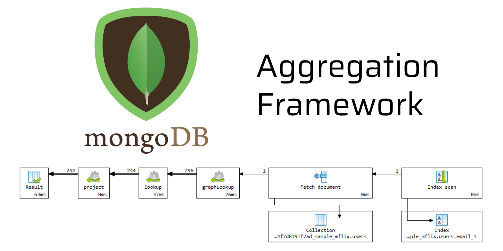

# MongoDB 聚合操作



我们都知道，Mongodb 是 NoSQL 数据库，为了达到各种查询和组合等功能，MongoDB 提供了丰富的聚合操作，是 Mongodb 的典型特色之一，例如对集合进行分组、排序、计算聚合值等操作。聚合操作值来自多个文档，可以对分组数据执行各种操作，以返回单个结果。聚合操作通常分为三类：单一作用聚合，聚合管道，MapReduce。下面我们将逐个了解他们：

## 单一作用聚合

该聚合提供了对场景聚合过程的简单访问，操作都是从单个集合聚合文档。比如，常用的`estimatedDocumentCount()`/`count()`/`distinct()`等这类聚合都是单一作用聚合。好处是对单一文档提供访问聚合，简单易用。但是缺乏聚合管道和`MapReduce`的灵活性和功能的强大性。

例如：

```bash
> db.students.distinct("class")
[ 0, 1, 2 ]

> db.students.find({age: {$gt: 200}}).count()
9800

> db.students.find({age: {$gt: 200}}).sort({age: -1})
{ "_id" : ObjectId("64a4e2b54fcc05651a91aad8"), "name" : "name10000", "age" : 10000, "class" : 0 }
{ "_id" : ObjectId("64a4e2b54fcc05651a91aad7"), "name" : "name9999", "age" : 9999, "class" : 1 }
{ "_id" : ObjectId("64a4e2b54fcc05651a91aad6"), "name" : "name9998", "age" : 9998, "class" : 0 }
{ "_id" : ObjectId("64a4e2b54fcc05651a91aad5"), "name" : "name9997", "age" : 9997, "class" : 1 }
{ "_id" : ObjectId("64a4e2b54fcc05651a91aad4"), "name" : "name9996", "age" : 9996, "class" : 0 }
```

## 聚合管道

Mongodb 聚合框架(Aggregation Framework)是一个计算框架，它可以作用在一个或多个集合上面，对集合的数据进行一系列运算，并将这些数据转换为期望的形式。从效果而言，聚合相当于关系型数据库中的`Group By`, `Left Join`, `AS`等。

### 管道(Pipeline) 和 阶段(Stage)

整个聚合运算被称为管道，它是由多个阶段组成的。每个管道可以接受一系列文档作为原始数据，经过每个阶段对这些数据的运算，输出最终的结果。


聚合管道操作语法如下：

```bash
pipelines = [$stage1, $stage2, ...$stageN]
db.collection.aggregate(pipelines, {options})
```

- pipelines: 一组数据的聚合阶段，由多个阶段组成。除了`$out`/`$merge`/`$geonear`阶段之外，每个阶段都可以在聚合中出现多次。
- options：可选，聚合操作的其他参数，包括：查询计划，是否使用临时文件，最大操作时间，读写策略，强制索引等。

### 常用的管道聚合阶段


#### $match

`$match`用于对文档进行筛选，之后可以在得到的文档子集上做聚合，`$match`可以使用除了地理空间之外的所有常规查询操作符，在实际应用中尽可能将`$match`放在管道位置的最前面，这样做有两个好处：

1. 可以快速的将不需要的文档过滤到，减少管道工作量。
2. 如果是再投射和分组之前执行`$match`，查询可以使用索引。

```bash
db.students.aggregate([{$match: {age: {$gt: 200}}}])
{ "_id" : ObjectId("64a4e2af4fcc05651a918491"), "name" : "name201", "age" : 201, "class" : 1 }
{ "_id" : ObjectId("64a4e2af4fcc05651a918492"), "name" : "name202", "age" : 202, "class" : 0 }
{ "_id" : ObjectId("64a4e2af4fcc05651a918493"), "name" : "name203", "age" : 203, "class" : 1 }
{ "_id" : ObjectId("64a4e2af4fcc05651a918494"), "name" : "name204", "age" : 204, "class" : 0 }
{ "_id" : ObjectId("64a4e2af4fcc05651a918495"), "name" : "name205", "age" : 205, "class" : 1 }
{ "_id" : ObjectId("64a4e2af4fcc05651a918496"), "name" : "name206", "age" : 206, "class" : 0 }
```

#### $project

投影操作，类似与 SQL 中的 AS，用于将原始字段转换为自定字段的名称，也可以用于指定输出文档中包含或排除的字段，并对字段进行重命名或计算新的表达式。如果要排除字段，将其设置为 0，保留字段，将其设置为 1 即可，

```bash
> db.students.aggregate([{$match: {age: {$gt: 200}}},
                         {$project: {name:"姓名", age: "年龄", _id: 0, class: 1}}
                         ])
{ "class" : 1, "name" : "姓名", "age" : "年龄" }
{ "class" : 0, "name" : "姓名", "age" : "年龄" }
{ "class" : 1, "name" : "姓名", "age" : "年龄" }
{ "class" : 0, "name" : "姓名", "age" : "年龄" }
{ "class" : 1, "name" : "姓名", "age" : "年龄" }
{ "class" : 0, "name" : "姓名", "age" : "年龄" }
```

#### $group 

按照指定的文档表达式对文档进行分组，并将每个不同分组的文档输出到下一阶段。输出文档包含一个_id字段，该字段按建包含不同组。输出文档还可以包含计算字段，该字段保存由$group的_id字段分组的一些accumulator表达式的值。$group不会输出具体的文档，而是输出统计信息。语法如下：
```bash
{$group: {_id: <expression>, <feild1>: {<accumulator1>: <expression1>}, ...} }
```
* _id: 该字段是必填字段，可以指定为null为整个文档计算累计值。
* 剩余的字段是可选地，并使用`accumulator`运算符进行计算。
* _id和accumulator表达式可以接受任何有效的表达式。

下面是一些常用的计算函数：


例如：
```bash
> db.students.aggregate([
        {$match: {age: {$gt: 200}}},
...     {$group: {_id: "$class", count: {$sum: 1}}}
... ])
{ "_id" : 0, "count" : 4900 }
{ "_id" : 1, "count" : 4900 }
```

#### $limit 和 $skip

`$limit`用于限制返回的文档数量, `$skip`用于跳过指定数量的文档， 二者组合可以使用分页查询。

```bash
> db.students.aggregate([
  { $skip: 10 },
  { $limit: 5 }
])
{ "_id" : ObjectId("64a4e2af4fcc05651a9183d0"), "name" : "name8", "age" : 8, "class" : 0 }
{ "_id" : ObjectId("64a4e2af4fcc05651a9183d1"), "name" : "name9", "age" : 9, "class" : 1 }
{ "_id" : ObjectId("64a4e2af4fcc05651a9183d2"), "name" : "name10", "age" : 10, "class" : 0 }
{ "_id" : ObjectId("64a4e2af4fcc05651a9183d3"), "name" : "name11", "age" : 11, "class" : 1 }
{ "_id" : ObjectId("64a4e2af4fcc05651a9183d4"), "name" : "name12", "age" : 12, "class" : 0 }
```

#### $sort

这个聚合操作用于按字段（field）对文档进行升序排序(1),降序为(-1).
```bash
db.collection.aggregate([
  { $sort: { field: 1 } }
])
```

例如：
```bash
> db.students.aggregate([     {$sort: {age: -1}} ])
{ "_id" : ObjectId("649e91c8f6974a8ff9ea61a8"), "name" : "zhangsan", "age" : 40, "class" : 1 }
{ "_id" : ObjectId("649e91eaf6974a8ff9ea61aa"), "name" : "wangwu22", "age" : 30, "class" : 2 }
{ "_id" : ObjectId("649e91d5f6974a8ff9ea61a9"), "name" : "wangwu", "age" : 20, "class" : 1 }
```

#### $loopup

在 MongoDB 聚合管道中，$lookup 是一个用于执行关联操作（join）的阶段操作符, 该功能是在3.2版本中新增的，用于实现多表关联查询。它允许你在一个集合中查找与另一个集合相关联的文档，并将它们合并到输出结果中。

语法如下：
```bash
db.collecton.aggregate({
    $loopup: {
        from: "<collection to join>",
        localField: "field from the input documnets",
        foreignField: "field from the documents of the from collection",
        as: "<output array field>"
    }
})
```

属性说明如下：
* from: 同一个数据库下等待被join的集合。
* localField：源集合的match值，如果输入的集合中，某文档没有localField这个key，在处理过程中，会默认为此文档含有localField：null的键值对。
* foreignField：待join的集合的match值，如果待join的集合中，文档没有foreignField的值，在处理过程中，会默认为此文档含有foreignField：null的键值对。
* as: 为输出文档新增值命名，如果输入的集合中已经存在该值，则会覆盖掉。

例如：

假设有两个集合：orders 和 customers，其中 orders 集合包含订单信息，而 customers 集合包含客户信息。我们可以使用 $lookup 来关联这两个集合，将订单文档与对应的客户文档合并为一个输出文档。

```bash
# 给orders插入数据
db.orders.insertMany([
  {
    "_id": 1,
    "orderNumber": "ORD001",
    "customerId": 101
  },
  {
    "_id": 2,
    "orderNumber": "ORD002",
    "customerId": 102
  },
  {
    "_id": 3,
    "orderNumber": "ORD003",
    "customerId": 101
  }
])

# 给customers插入数据
db.customers.insertMany([
  {
    "_id": 101,
    "name": "John",
    "email": "john@example.com"
  },
  {
    "_id": 102,
    "name": "Alice",
    "email": "alice@example.com"
  }
])

# lookup关联查询
> db.orders.aggregate([
  {
    $lookup: {
      from: "customers",
      localField: "customerId",
      foreignField: "_id",
      as: "customer"
    }
  }
])
{ "_id" : 1, "orderNumber" : "ORD001", "customerId" : 101, "customer" : [ { "_id" : 101, "name" : "John", "email" : "john@example.com" } ] }
{ "_id" : 2, "orderNumber" : "ORD002", "customerId" : 102, "customer" : [ { "_id" : 102, "name" : "Alice", "email" : "alice@example.com" } ] }
{ "_id" : 3, "orderNumber" : "ORD003", "customerId" : 101, "customer" : [ { "_id" : 101, "name" : "John", "email" : "john@example.com" } ] }
```

## MapReduce

该操作将大量数据处理工作拆分为多个线程并行处理，然后将结果合并在一起。MapReduce提供的函数非常灵活，对于大规模数据分析也相当实用。

MapReduce具有两个阶段：
1. 将具有想通key的文档整合在一起的Map阶段
2. 组合map操作的结果进行统计输出的reduce阶段

MapReduce的基本语法如下：

