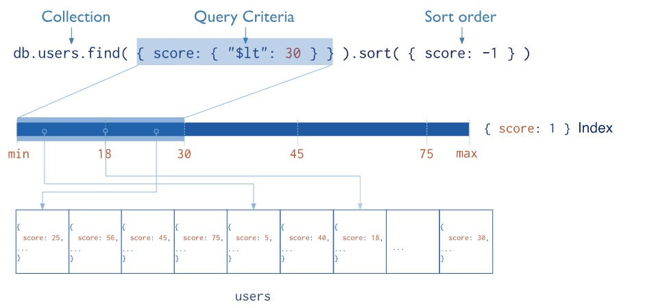

# MongoDB 的索引


索引是对任何数据库来说都非常重要，MongoDB亦是如此，它支持多种索引类型，今天我们就来学习它！

索引的真正的本质是降低我们查询数据所查询的范围，Mongodb 的索引是定义在 collection 级别的，使用B-tree 这一特殊的数据结构，支持对任何单个 field 以及任何 sub-field 建立索引。



## 默认的`_id`索引

Mongodb 在 collection 创建时会默认建立一个基于`_id`的唯一性索引作为document的primary key，这个index无法被删除。

我们可以使用命令`db.collection.getIndexes()`来查看Collection的`_id`索引：
```java
> db.students.getIndexes()
[ { "v" : 2, "key" : { "_id" : 1 }, "name" : "_id_" } ]
```

## 索引的基本操作

索引的基本操作包括创建索引，删除索引和查询索引。

### 创建索引

创建索引的命令如下：
```bash
db.collection.createIndex( <key and index type specification>, <options> )
db.collection.createIndex({key:1}) # 创建普通索引
db.collection.createIndex({key:1}，{unique:true}) # 创建唯一索引
db.collection.createIndex({key:1}，{name: "name"}) # 创建索引并指定名称
```
说明：
1. 语法中`Key`值为你要创建的索引字段.
2. `1`为指定按升序创建索引，如果你想按降序来创建索引指定为`-1`即可.
3. 索引的默认名称是索引键和索引中每个键的方向(即1或-1)的连接，使用下划线作为分隔符。例如，在**{ item : 1, quantity: -1 }上创建的索引名称为item_1_quantity_-1**。
4. 可选参数常用的有如下几个：

| Parameter | Type | Description |
| :-------: | ---- | ----------- |
|background	| Boolean |	建索引过程会阻塞其它数据库操作，background可指定以后台方式创建索引，即增加 "background" 可选参数。 "background" 默认值为false。
| unique	| Boolean	| 建立的索引是否唯一。指定为true创建唯一索引。默认值为false.
| name	| string	| 索引的名称。如果未指定，MongoDB的通过连接索引的字段名和排序顺序生成一个索引名称。
| dropDups	| Boolean	| 在建立唯一索引时是否删除重复记录,指定 true 创建唯一索引。默认值为 false.
| sparse	| Boolean	| 对文档中不存在的字段数据不启用索引；这个参数需要特别注意，如果设置为true的话，在索引字段中不会查询出不包含对应字段的文档.。默认值为 false.
| expireAfterSeconds	| integer |	指定一个以秒为单位的数值，完成 TTL设定，设定集合的生存时间。
| weights	| document	| 索引权重值，数值在 1 到 99,999 之间，表示该索引相对于其他索引字段的得分权重。

### 删除索引

要删除一个索引，你可以使用以下命令：

```bash
db.collection.dropIndex("indexName")
```

将 `collection` 替换为你要删除索引的集合名称，而 `"indexName"` 则是你要删除的索引的名称。执行该命令后，MongoDB将删除指定名称的索引。

如果你不知道索引的名称，可以先使用 `db.collection.getIndexes()` 命令查看集合中的所有索引，并找到要删除的索引的名称。

示例：
```bash
db.collection.dropIndex("field1_1_field2_-1")
```

在上述示例中，我们删除了一个名为 `"field1_1_field2_-1"` 的索引。

请注意，删除索引可能会影响到相关查询的性能。确保你要删除的索引不再需要，并在删除之前进行充分的测试和评估。

当然，简单起见，你可以使用下面的方法删除索引
```bash
db.collection.dropIndex({key: 1 or -1})
```

## 索引的分类

MongoDB支持多种索引类型，下面是一些常用的索引：

### 单键索引（Single-Field Index）

单建索引是MongoDB中最简单的索引类型，对单个建创建的索引就是单建索引，上面我们例子中创建的索引都是单建索引。对于单建索引，索引的顺序无关紧要，因为 MongoDB 支持任意顺序遍历单建索引。

### 复合索引（Compound Index）

相对于单建索引，基于多个字段创建的索引就叫做复合索引。

例如：
```bash
db.collection.createIndex({ field1: 1, field2: -1 })
```

在复合索引中 field 的顺序对索引的性能有至关重要的影响，比如索引 {field1:1, field2:-1} 首先根据 field1 排序，然后再在每个 field1 中根据 field2 排序。

上面的索引支持一下查询：
```bash
db.collection.find( { field1: "xxxx" } )
db.collectoin.find( { field1: "xxxx", field2: { $gt: 5 } } )
```
从上面的查询可以知道，`{ field1: "xxxx" }`之所以满足索引查询条件，主要是因为该条件满足复合索引的Prefix原则。下面我们简单介绍一下这个原则：

#### Prefix原则

复合索引的 Prefix 原则是指在复合索引中，如果查询只涉及到索引中的一部分字段，那么只有从索引的最左侧开始的字段才能被有效利用。

具体来说，当你创建一个复合索引时，MongoDB会按照指定的字段顺序创建索引。在查询时，如果你只使用索引中的前缀字段进行查询，那么这个复合索引可以被有效地利用。但如果你在查询中使用了索引中的后续字段而跳过了前缀字段，那么索引将无法被有效利用。

下面是一个示例来说明复合索引的 Prefix 原则的使用：

假设有一个 `orders` 集合，包含以下字段：`{ customer: "Alice", status: "active", product: "Apple" }`，并且创建了复合索引 `{ customer: 1, status: 1, product: 1 }`。

**查询1：使用复合索引的前缀字段**
```javascript
db.orders.find({ customer: "Alice" })
```
这个查询可以有效地利用复合索引的前缀字段 `customer`。

**查询2：跳过了复合索引的前缀字段**
```javascript
db.orders.find({ status: "active" })
```
这个查询无法有效利用复合索引，因为它跳过了前缀字段 `customer`。

**查询3：使用了复合索引的全部字段**
```javascript
db.orders.find({ customer: "Alice", status: "active", product: "Apple" })
```
这个查询可以有效地利用复合索引的全部字段。

为了充分利用复合索引的性能优势，你需要根据查询模式和查询字段的顺序来选择正确的索引创建顺序。将最常用且高选择性的字段放在前面，可以确保查询能够最大限度地利用复合索引。

需要注意的是，过多的索引字段和索引的大小可能会对存储空间和写入性能产生一定的影响。因此，在创建复合索引时，应权衡查询性能和存储需求之间的平衡。

总结而言，复合索引的 Prefix 原则要求查询中只涉及到复合索引的前缀字段，以确保索引可以被有效利用，提高查询性能。

#### 排序的影响

前文说过单建索引的 sort 顺序无关紧要，但是复合索引则完全不同。

考虑有如下场景：
```bash
db.events.find().sort( { username: 1, date: -1 } )
```
events collection 有一个上面的查询，首先结果根据 username 进行 ascending 排序，然后再对结果进行 date descending 排序，
或者是下面的查询：
```bash
db.events.find().sort( { username: -1, date: 1 } )
```
根据 username 进行 descending 排序，然后再对 date 进行 ascending 排序，索引：
```bash
db.events.createIndex( { "username" : 1, "date" : -1 } ）
```
可以支持这两种查询，但是下面的查询不支持：
```bash
db.events.find().sort( { username: 1, date: 1 })
```

也就是说 sort 的顺序必须要和创建索引的顺序是一致的，一致的意思是不一定非要一样，总结起来大致如下


**即排序的顺序必须要和索引一致，逆序之后一致也可以.**

## 索引的分析

虽然索引能极大的提升查询性能，但是有时候索引并不能完全匹配，如果你想看看某个查询是否用到了索引，该如何？

### Explain

MongoDB 默认提供了类似 MySQL explain 的语句来分析查询语句的来对我们正确建立索引提供帮助，在建立索引时我们需要对照 explain 对各种查询条件进行分析。

例如：
```bash
db.student.find({name: "zhangsan"}).explain()
{
	"queryPlanner" : {
		"plannerVersion" : 1,
		"namespace" : "school.student",
		"indexFilterSet" : false,
		"parsedQuery" : {
			"name" : {
				"$eq" : "zhangsan"
			}
		},
		"winningPlan" : {
			"stage" : "EOF"
		},
		"rejectedPlans" : [ ]
	},
	"serverInfo" : {
		"host" : "e7f1280157b9",
		"port" : 27017,
		"version" : "4.4.22",
		"gitVersion" : "fc832685b99221cffb1f5bb5a4ff5ad3e1c416b2"
	},
	"ok" : 1
}
```

在 explain() 方法的输出结果中，queryPlanner 字段提供了查询计划的详细信息，其中的 winningPlan 字段描述了 MongoDB 选择的执行计划。

在 winningPlan 字段中，可以通过查看 inputStage 字段中的 stage 属性来确定是否使用了索引。常见的 stage 属性值与索引使用的关系如下：
* COLLSCAN：表示全表扫描，未使用索引。
* IXSCAN：表示使用了索引扫描。
* EOF： 表示查询已经完成，并且可能会显示一些统计信息，例如扫描的文档数量 (totalDocsExamined) 和扫描的键数量 (totalKeysExamined)，以及查询的执行时间 (executionTimeMillis)。这些信息可以帮助你了解查询的性能和资源使用情况。

需要注意的是，explain() 方法只是用于查询查询执行计划和性能统计的工具，它本身并不执行查询操作。因此，执行 explain() 方法不会返回实际的查询结果。

### 慢查询

慢查询是指在执行过程中花费了相对较长时间的查询操作。慢查询可能会对数据库的性能产生负面影响，并且可能需要进一步的优化来提高查询的执行效率。

MongoDB 提供了慢查询日志功能，可以用来记录执行时间超过预定阈值的查询操作。通过开启慢查询日志，你可以收集和分析慢查询，以便优化查询性能。

要开启慢查询日志，可以按照以下步骤进行设置：

1. 打开 MongoDB 的配置文件（例如 `mongod.conf`）。

2. 找到 `systemLog` 部分，并确保 `destination` 字段的值设置为文件路径。例如：
```bash
systemLog:
  destination: file
  path: /var/log/mongodb/mongod.log
```

3. 添加以下设置以启用慢查询日志：
```bash
operationProfiling:
  slowOpThresholdMs: 100
```
上述配置中，`slowOpThresholdMs` 指定了执行时间超过 100 毫秒的操作将被记录为慢查询。

4. 保存并关闭配置文件。

5. 重启 MongoDB 以使配置生效。

完成以上步骤后，MongoDB 将开始记录执行时间超过阈值的慢查询到指定的日志文件中，上面的是这个`/var/log/mongodb/mongod.log`, 在日志文件中，你可以找到被记录为慢查询的语句。慢查询日志的每一条记录都包含了执行时间超过阈值的查询操作的相关信息，例如查询语句、执行时间、命名空间等。

请注意，设置慢查询日志可能会对数据库的性能产生一些额外的开销。因此，建议在需要进行性能分析和优化时才开启慢查询日志，并根据具体需求调整慢查询的阈值设置。