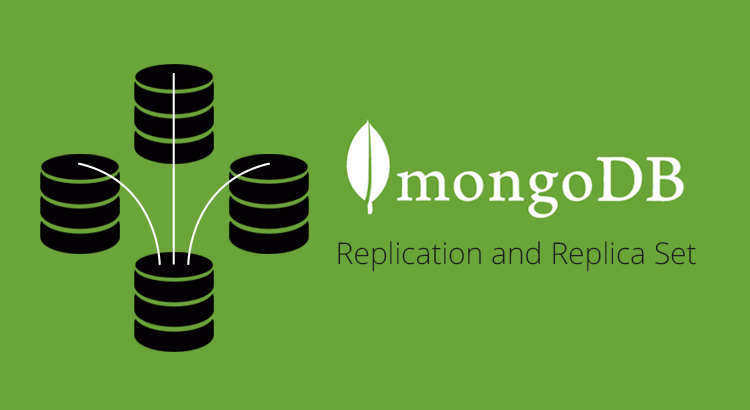
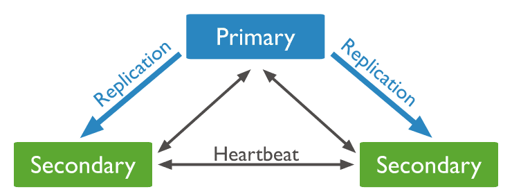
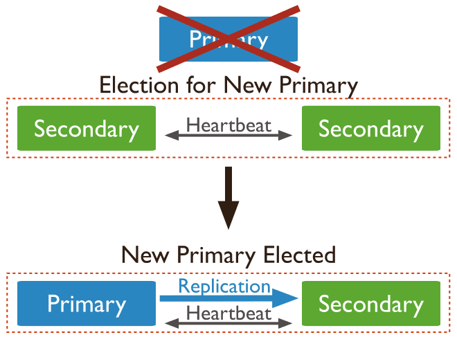
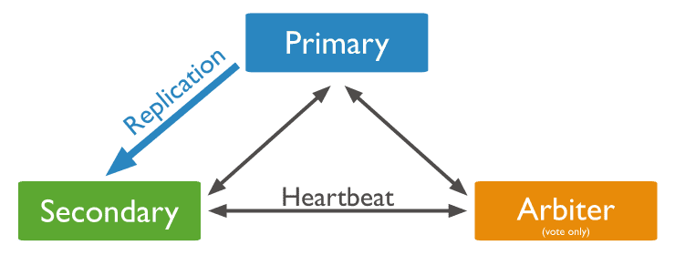
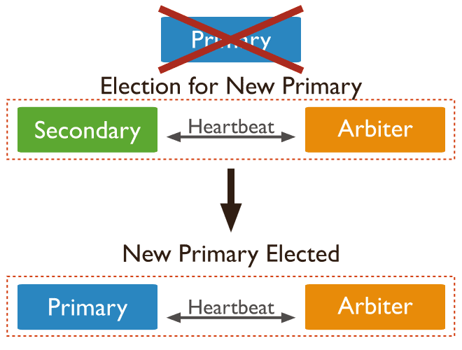

# MongoDB 复制集



**MongoDB 的复制集（Replica Set）是一种数据复制和高可用性的解决方案。它由多个 MongoDB 实例组成，其中一个被称为主节点（Primary），其余实例称为从节点（Secondary），还可以有一个仲裁节点（Arbiter）。**

* 复制集中的主节点负责处理所有写入操作，并将写入的数据复制到所有从节点上。
* 从节点复制主节点的数据，用于提供读取操作的高可用性和横向扩展性。
* 仲裁节点则用于选举主节点和保持复制集的配置信息。Arbiter节点只参与投票，不能被选为Primary，并且不从Primary同步数据

从上面的信息我们可以知道，MongoDB复制集和MySQL的主从备份不同：
* 主节点是唯一的： 没有MySQL的那种双子结构。
* 大多数原则：集群存活节点小于或者定于二分之一时集群不可写，只可以读。
* 从库无法写入：MySQL从库的readonly对于super权限的账户无效。

## 选举机制

***所谓选举机制，就是当某个节点宕机时，复制集选择主节点的过程。***

### 选出Primary

假设复制集内能够投票的成员数量为N，则大多数为 N/2 + 1，当复制集内存活成员数量不足大多数时，整个复制集将无法选举出Primary，复制集将无法提供写服务，处于只读状态。

举例：3投票节点需要2个节点的赞成票，容忍选举失败次数为1；4个节点的复制集和3个节点的一样，只能容忍1个节点宕机；5投票节点需要3个节点的赞成票，容忍选举失败次数为2；通常投票节点为奇数，这样可以减少选举失败的概率。

### 触发选举机制
在以下的情况将触发选举机制：
* 往复制集中新加入节点
* 初始化复制集时
* 对复制集进行维护时，比如rs.stepDown()或者rs.reconfig()操作时
* 从节点失联时，比如超时（默认是10秒）

需要注意的是，不是所有的节点都会参与投票，一个复制集最高可以有50个节点，但是只有7个投票节点。一个非投票节点它的votes是0即vote0; 它的priority是0即priority0。同时可投票的节点，必须属于如下状态之一：PRIMARY, SECONDARY, STARTUP2, RECOVERING, ARBITER, ROLLBACK.


## 复制集常见部署架构

由于选举机制的规定，最好是将集群的节点设置为基数，如果集群的节点是偶数的情况下，我们建议通过添加Arbiter节点只参与投票。从这个角度出发，基本上有如下两种架构：

### 一主两从



该集群由一个主节点和两个从节点组成，当主节点宕机后,两个从节点都会进行竞选，其中一个变为主节点，当原主节点恢复后，作为从节点加入当前的复制集群即可。



### 一主一从一仲裁



该集群架构是由一个主节点，一个从节点和一个仲裁节点构成，当主节点宕机时，将会选择从节点成为主，主节点修复后，将其加入到现有的复制集群中即可。



## 复制集的数据同步

Primary与Secondary之间通过oplog来同步数据，Primary上的写操作完成后，会向特殊的`local.oplog.rs`特殊集合写入一条oplog，Secondary不断的从Primary取新的oplog并应用。

> oplog(操作日志)是一个特殊的有上限的集合(老的日志会被overwrite)，它保存所有修改数据库中存储的数据的操作的滚动记录。

如下oplog的格式，包含ts、h、op、ns、o等字段:
```json
{
  "ts" : Timestamp(1446011584, 2),
  "h" : NumberLong("1687359108795812092"), 
  "v" : 2, 
  "op" : "i", 
  "ns" : "test.nosql", 
  "o" : { "_id" : ObjectId("563062c0b085733f34ab4129"), "name" : "mongodb", "score" : "100" } 
}
```
字段说明如下：
* ts： 操作时间，当前timestamp + 计数器，计数器每秒都被重置
* h：操作的全局唯一标识
* v：oplog版本信息
* op：操作类型
  * i：插入操作
  * u：更新操作
  * d：删除操作
  * c：执行命令（如createDatabase，dropDatabase）
  * n：空操作，特殊用途
* ns：操作针对的集合
* o：操作内容，如果是更新操作
* o2：操作查询条件，仅update操作包含该字段。

因oplog的数据会不断增加，local.oplog.rs被设置成为一个capped集合，当容量达到配置上限时，会将最旧的数据删除掉。另外考虑到oplog在Secondary上可能重复应用，oplog必须具有幂等性，即重复应用也会得到相同的结果

Secondary初次同步数据时，会先进行init sync，从Primary（或其他数据更新的Secondary）同步全量数据，然后不断通过tailable cursor从Primary的local.oplog.rs集合里查询最新的oplog并应用到自身。

### init sync过程包含如下步骤

* T1时间，从Primary同步所有数据库的数据（local除外），通过listDatabases + listCollections + cloneCollection敏命令组合完成，假设T2时间完成所有操作。
* 从Primary应用[T1-T2]时间段内的所有oplog，可能部分操作已经包含在步骤1，但由于oplog的幂等性，可重复应用。
* 根据Primary各集合的index设置，在Secondary上为相应集合创建index。（每个集合_id的index已在步骤1中完成）。

oplog集合的大小应根据DB规模及应用写入需求合理配置，配置得太大，会造成存储空间的浪费；配置得太小，可能造成Secondary的init sync一直无法成功。比如在步骤1里由于DB数据太多、并且oplog配置太小，导致oplog不足以存储[T1, T2]时间内的所有oplog，这就Secondary无法从Primary上同步完整的数据集。

## 复制集的创建

下面我们将使用Docker来创建一个一主两从的复制集, 命令如下
```bash
# 创建一个 Docker 网络，用于连接复制集的各个容器
docker network create mongo-network 

# 创建一个主节点的容器，使用 --network 参数将容器连接到创建的网络中
docker run -d --name mongo-primary --network mongo-network -p 27017:27017 mongo:latest --replSet my-replica-set --bind_ip_all

# 创建两个从节点的容器，同样使用 --network 参数将容器连接到创建的网络中
docker run -d --name mongo-secondary1 --network mongo-network mongo:latest --replSet my-replica-set --bind_ip_all
docker run -d --name mongo-secondary2 --network mongo-network mongo:latest --replSet my-replica-set --bind_ip_all
```

进入主节点，初始化复制集：
```bash
# 进入主节点容器，并初始化复制集
docker exec -it mongo-primary mongo

rs.initiate({
  _id: "my-replica-set",
  members: [
    { _id: 0, host: "mongo-primary:27017" },
    { _id: 1, host: "mongo-secondary1:27017" },
    { _id: 2, host: "mongo-secondary2:27017" }
  ]
});
```

经过上面的命令，你就可以创建一个一主两从的复制集。

## 复制集的常用命令

下面我们介绍一些常用的集群操作命令：
* db.isMaster(): 查看谁是主节点。
* rs.conf(): 查看当前复制集集群中成员的配置。
* rs.status(): 查看复制集集群成员状态。
* rs.add("10.211.55.12:27020"): 新增节点到复制集 新增节点之前，该实例的配置中的replSetName复制集名称，必须和集群一致。
* rs.addArb("10.211.55.12:27020"): 新增仲裁节点。
* rs.remove("10.211.55.12:27020"): 从复制集内删除节点。
* rs.stepDown(120): 降级服务器 此操作只能在PRIMARY上操作 通过执行rs.stepDown命令将当前主服务器主动降级为备用节点，120单位为s，为120秒内这个实力不能把自己选为PRIMARY角色，120秒后由于它本身的优先级较高，所以会重新抢占PRIMARY节点。
* rs.slaveOk()：允许在Secondary节点可以进行查询 在副本节点上操作。
* db.getMongo()：查看当前连接。

## 复制集的应用价值：
1. **高可用性：** 复制集可以提供故障转移和自动故障恢复。如果主节点发生故障，复制集会自动从从节点中选举一个新的主节点来替代。
2. **数据冗余和容错：** 复制集中的数据被复制到多个从节点上，确保数据的冗余性和容错性。即使主节点发生故障，数据仍然可用于读取操作。
3. **横向扩展：** 复制集允许在从节点上进行读取操作，实现了读取负载的分布和横向扩展。通过添加更多的从节点，可以增加系统的读取吞吐量。
4. **快速故障恢复：** 当主节点发生故障时，复制集可以迅速选举新的主节点，从而实现快速的故障恢复。

使用复制集，你可以构建高可用性的 MongoDB 部署，并提供数据冗余、故障转移和横向扩展的功能。复制集是许多 MongoDB 应用的基础架构，可满足对数据可用性和可靠性的需求。